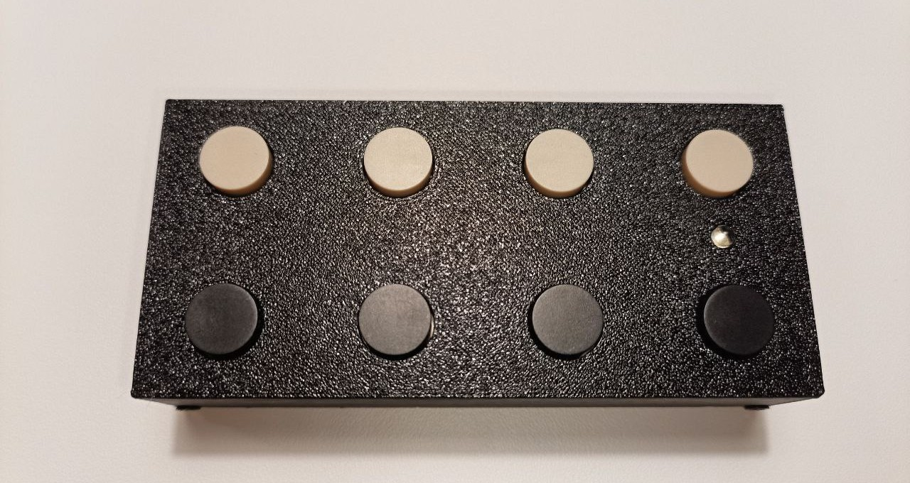

# b8

A simple USB keypad with 8 programmable buttons.


## Motivation / Project requirements

- [x] I wanted to have a simple keypad I could use to control my computer.
- [x] I wanted to be able to write userspace programs in Golang, that would react to the keypress events in the keypad and execute some Golang code instead of building long sequences of keypress macros.
- [x] I wanted the PCB to be simple (PTH parts only), to have only the buttons and a single indicator LED, and to use the simplest/smallest microcontroller that could handle USB 1.1 and 8 buttons (I picked one of my favorites: [ATtiny4313](https://www.microchip.com/en-us/product/attiny4313)).
- [x] I wanted the enclosure to be 3D-printed at home.
- [x] I wanted it to be as USB HID compliant as possible, so I could learn more about the USB stack and specifications.
- [x] I wanted the client library to support at least Linux and Windows.

> [!NOTE]
> After using the original [`b8`](#b8) keypad for a few months I realized that having a small OLED screen added to the keypad could be very useful. This new addition required using a more powerful microcontroller (I picked the [`STM32F042K6`](https://www.st.com/en/microcontrollers-microprocessors/stm32f042k6.html), which is not PTH, but still quite easy to hand-solder).
>
> These additions resulted in a new `b8` keypad variant named [`b8-mega`](#b8-mega). This new variant also includes support for 5-pin mechanical keyboard switches instead of the simpler 12mm SPST push-buttons used in the original variant.
>
> The original `b8` keypad variant is still actively used and maintained.


## Variants

### b8-mega


### b8




## What is included

- [Firmware source code](./firmware/)
- [Golang client library](./go/b8/)
- [Printed Circuit Board (Kicad sources)](./pcb/)
- [3D models for simple enclosures](./3d-models/)
- [`udev` rules for Linux](./share/udev/)


## Program examples

### Simple

```go
package main

import (
	"fmt"
	"log"
	"time"

	"github.com/rafaelmartins/b8/go/b8"
)

func main() {
	dev, err := b8.GetDevice("")
	if err != nil {
		log.Fatal(err)
	}

	if err := dev.Open(); err != nil {
		log.Fatal(err)
	}
	defer dev.Close()

	for i := 0; i < 3; i++ {
		dev.Led(b8.LedFlash)
		time.Sleep(100 * time.Millisecond)
	}

	dev.AddHandler(b8.BUTTON_1, func(b *b8.Button) error {
		fmt.Println("pressed")
		duration := b.WaitForRelease()
		fmt.Printf("released. pressed for %s\n", duration)
		return nil
	})

	if err := dev.Listen(nil); err != nil {
		log.Fatal(err)
	}
}
```


## F.A.Q.

### How to use this keypad to control `OBS`, similarly to what the `Stream Deck` does?

You can write event handlers that interact with `OBS` by using the `goobs` library: https://github.com/andreykaipov/goobs
